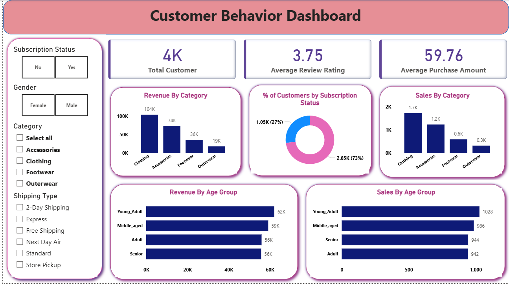

# 📊 Data Analytics Project – Python, SQL & Power BI

## 🔎 Overview
This project analyzes customer shopping behavior using Python, SQL, and Power BI. The objective is to explore purchasing patterns, customer preferences, and sales trends to generate actionable business insights.

The project follows a complete data analytics workflow including data cleaning, exploratory data analysis (EDA), SQL-based analysis, and dashboard visualization.

---

## 📂 Project Structure

Customer_shopping_behaviour
│
├── Dashboard
│ └── customer_behavior_dashboard.pbix
│
├── dataset
│ └── customer_shopping_behavior.csv
│
├── images
│ └── dashboard_image.png
│
├── notebooks
│ ├── Customer_shopping_behavior.ipynb
│ └── Customer_behavior_sql_analysis.sql
│
├── reports
│ ├── Customer Shopping Behavior Analysis.pdf
│ └── Customer-Shopping-Behavior-Analysis (Gamma Report)
│
├── requirements.txt
└── README.md

---

## 🛠 Tools & Technologies

### Programming
- Python

### Python Libraries
- Pandas
- NumPy
- Matplotlib
- Seaborn

### Database
- PostgreSQL
- SQLAlchemy
- psycopg2

### Visualization
- Power BI

### Development Environment
- VS Code

**Presentation**
- Gamma (for presentation generation)

---

## 📊 Dataset Description

The dataset contains customer shopping information including:

| Column | Description |
|------|-------------|
| customer_id | Unique customer identifier |
| age | Age of the customer |
| gender | Customer gender |
| item_purchased | Product purchased |
| category | Product category |
| purchase_amount | Amount spent |
| location | Customer location |
| size | Product size |
| color | Product color |
| season | Season of purchase |
| review_rating | Product rating |
| subscription_status | Customer subscription status |
| shipping_type | Shipping method |
| discount_applied | Discount applied or not |
| previous_purchases | Number of previous purchases |
| payment_method | Payment method used |
| frequency_of_purchases | Purchase frequency |
| age_group | Age group classification |
| purchase_frequency_days | Frequency of purchases in days |

---

## 🔍 Analysis Performed

### 1️⃣ Data Cleaning
- Handled missing values
- Verified data types
- Checked duplicates
- Standardized column names

### 2️⃣ Exploratory Data Analysis (EDA)
Analysis included:

- Customer demographics analysis
- Purchase amount distribution
- Product category popularity
- Seasonal shopping trends
- Discount impact on purchases
- Payment method preferences

### 3️⃣ SQL Analysis
SQL queries were written to analyze:

- Sales by category
- Top spending customers
- Average purchase value
- Purchase frequency patterns

### 4️⃣ Dashboard Development
A **Power BI interactive dashboard** was created to visualize key insights including:

- Total sales
- Customer demographics
- Category performance
- Purchase patterns

### 5. Reporting & Presentation
Insights from the analysis were summarized in:
- A detailed **PDF report**
- A **Gamma presentation report**

---

## 📊 Dashboard Insights
The dashboard highlights important business insights such as:

- Clothing is the most profitable and frequently purchased category.
- Young adults are the most valuable customer segment.
- There is strong potential to increase revenue by improving **subscription adoption**.
- Marketing campaigns should target **high-spending age groups and popular product categories**.

These insights help businesses improve strategy and profitability.

---

## 📊 Dashboard Preview

---

## 📄 Reports

Detailed analysis reports are available in the **reports** folder:

- Customer Shopping Behavior Analysis (PDF)
- Gamma Generated Report

---

## 👨‍💻 Author
**Priyank Shrivastava**
Email: priyankshrivastava5678@gmail.com